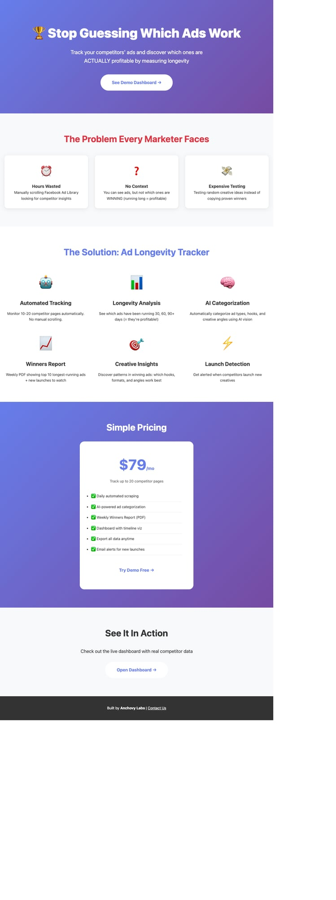
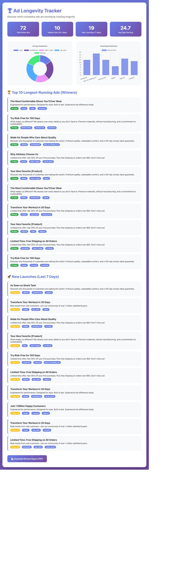

# 🏆 Ad Longevity Tracker

**Stop guessing which ads work. Track competitor ads and discover which ones are ACTUALLY profitable by measuring longevity.**




## The Problem

Small business owners and e-commerce sellers waste hours manually scrolling through Facebook Ad Library to spy on competitors. The real insight isn't just *what* ads they're running — it's **which ads have been running the longest** (30, 60, 90+ days). Long-running ads = profitable ads.

## The Solution

Ad Longevity Tracker automates this entire process:
- 🤖 **Automated scraping** of Facebook Ad Library for 10-20 competitor pages
- 📊 **Longevity tracking** to identify "veteran" ads (30+ days = winners)
- 🧠 **AI categorization** using vision models to analyze ad types and hooks
- 📈 **Weekly Winners Report** (PDF) with top 10 longest-running ads
- 🚀 **Launch detection** for newly launched competitor creatives

## Features

### 1. Facebook Ad Library Scraper
- Tracks 10-20 competitor Facebook pages automatically
- Detects new ad launches
- Monitors which ads get turned off vs. stay active
- No authentication needed (public data)

### 2. AI-Powered Analysis
- Categorizes ads: video, carousel, static image, UGC-style, professional
- Extracts hooks/angles: emotional, urgency, social proof, curiosity, FOMO
- Uses vision models to analyze creative elements

### 3. Winners Report
- PDF report showing:
  - Top 10 longest-running ads (proven winners)
  - New launches this week
  - Creative breakdown by category and hook
  - Suggested creative angles based on data

### 4. Dashboard
- Beautiful web interface with charts
- Ad timeline visualization
- Creative breakdown analytics
- Export to PDF

## Installation

```bash
npm install
```

## Quick Start

### Option 1: Demo Mode (Fastest)

```bash
# Seed demo data
node src/seed-demo.js

# Start dashboard
npm run dev

# Open http://localhost:3000/landing.html
```

### Option 2: Real Scraping

```bash
# 1. Run scraper (uses Playwright to scrape Facebook Ad Library)
npm run scrape

# 2. Analyze ads with AI (optional - requires OpenAI API key)
npm run analyze

# 3. Generate Winners Report
npm run report

# 4. Start dashboard
npm run dev
```

## Project Structure

```
ad-longevity-tracker/
├── src/
│   ├── db.js              # JSON-based data storage
│   ├── scraper.js         # Facebook Ad Library scraper (Playwright)
│   ├── analyzer.js        # AI categorization (OpenAI GPT-4 Vision)
│   ├── report-generator.js # PDF report generator
│   ├── server.js          # Express API server
│   └── seed-demo.js       # Demo data seeder
├── public/
│   ├── index.html         # Dashboard UI
│   └── landing.html       # Landing page
├── data/
│   ├── competitors.json   # Competitor pages being tracked
│   ├── ads.json          # Ad database
│   └── scrape-history.json # Scrape logs
└── package.json
```

## Tech Stack

- **Scraping**: Playwright (headless browser automation)
- **Storage**: JSON files (simple, portable, no native deps)
- **AI**: OpenAI GPT-4 Vision for ad categorization
- **Backend**: Express.js
- **Frontend**: Vanilla JS + Chart.js
- **Reports**: PDFKit

## Environment Variables

Create a `.env` file:

```env
OPENAI_API_KEY=your_key_here  # Optional, for AI analysis
PORT=3000                      # Server port
```

## API Endpoints

- `GET /api/stats` - Dashboard statistics
- `GET /api/ads/veterans?minDays=30&limit=10` - Get veteran ads
- `GET /api/ads/new?days=7` - Get newly launched ads
- `GET /api/ads/all` - Get all active ads
- `GET /api/competitors` - Get tracked competitors
- `POST /api/generate-report` - Generate Winners Report PDF
- `GET /api/download-report` - Download latest report

## Deployment

### Cloudflare Pages (Recommended)

```bash
# Build static dashboard
npm run build

# Deploy to Cloudflare Pages
# Point to /public directory
```

### Railway / Render / Heroku

```bash
# These platforms auto-detect Node.js apps
# Make sure to set PORT env var
# Add Playwright buildpack if needed
```

## Business Model

**Pricing**: $49-99/mo subscription

**Target Market**:
- Small business owners
- E-commerce sellers
- Facebook ad buyers
- Marketing agencies

**Value Proposition**:
- Save 10+ hours/week on manual research
- Copy proven winning ads (30+ day veterans)
- Stay ahead of competitor launches
- Data-driven creative testing

## Evidence of Demand

From Reddit research (`/ideas/overnight-research-feb15.md`):

> "wasting hours doing manual ad creative research yet I'm still guessing... so painfully time consuming." - r/smallbusiness user

> "Is there a real way to spy on competitors' ads beyond just Facebook Ad Library?" - r/advertising thread

## Next Steps

1. ✅ Working prototype (this!)
2. 🚧 Add email alerts for new launches
3. 🚧 Support for Instagram ads
4. 🚧 Multi-user auth system
5. 🚧 Stripe subscription billing
6. 🚧 Better AI categorization prompts
7. 🚧 Export data to Google Sheets

## License

MIT

## Contact

Built by **Anchovy Labs**  
Email: ezra@anchovylabs.ai  
Website: anchovylabs.ai

---

**Ship fast, iterate faster.** 🚀
